# LearnAID System Architecture

> **Educational Management Platform with AI-Powered Learning Support**  
> A comprehensive system for administrators, faculty, and students with intelligent MCQ generation and performance tracking.

---

## 🏗️ System Architecture Overview

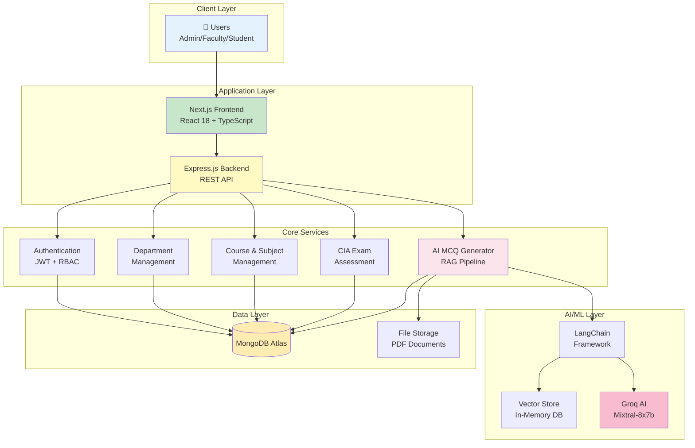

## 🎭 User Role Architecture

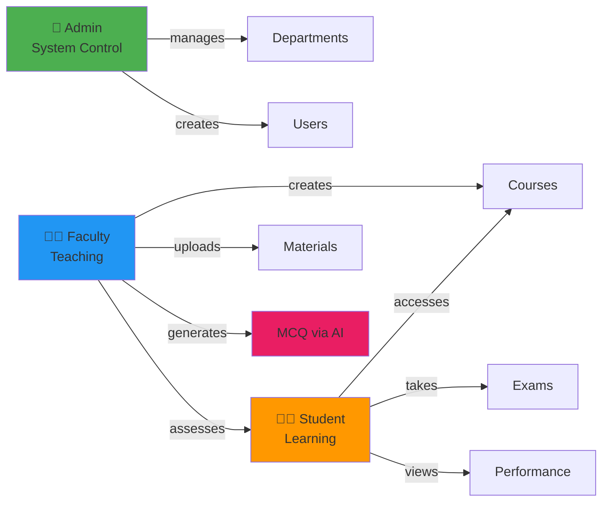

## 🔄 Core Business Flows

### Course & Assessment Workflow

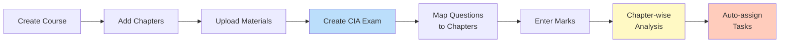

## 🤖 AI-Powered MCQ Generation Architecture

### RAG Pipeline Architecture

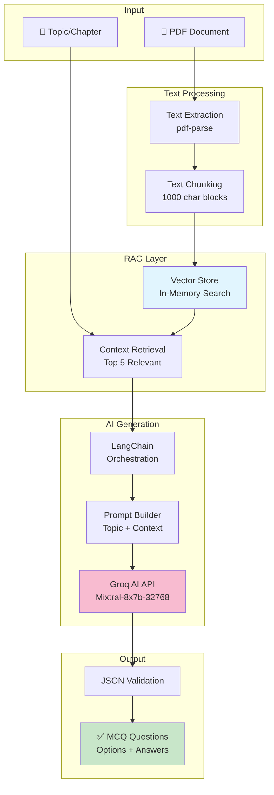

### MCQ Generation Sequence

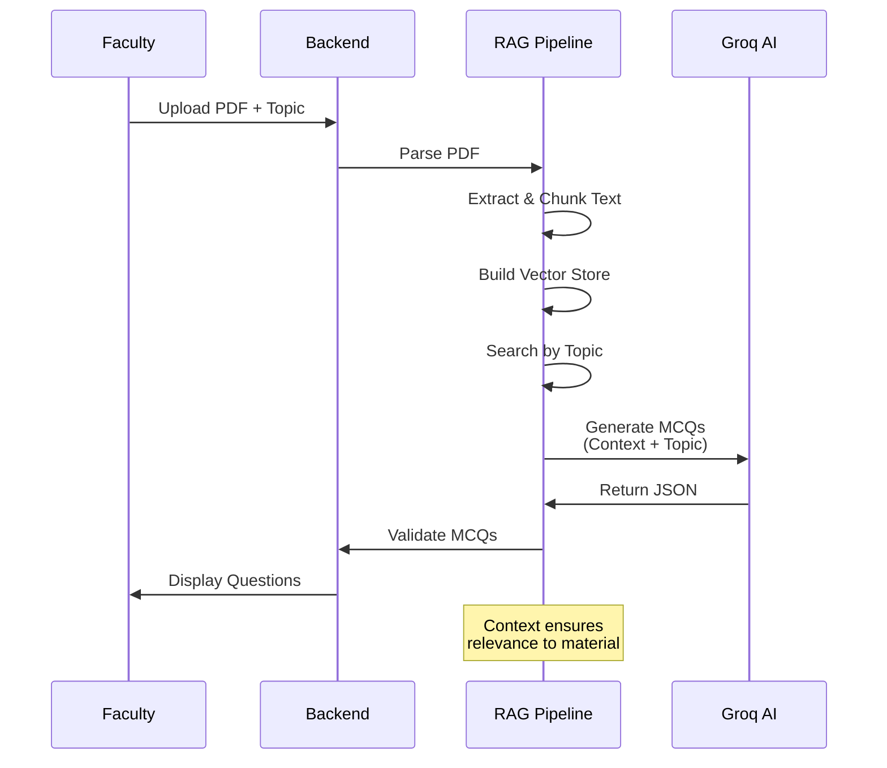

## 📊 Data Architecture

### Core Data Model

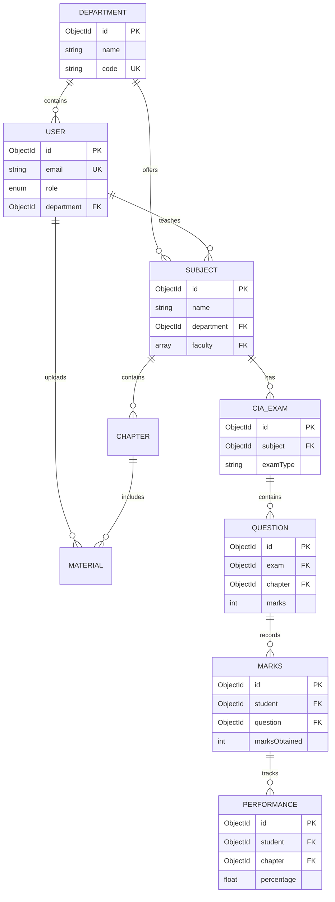

## 🛠️ Technology Stack

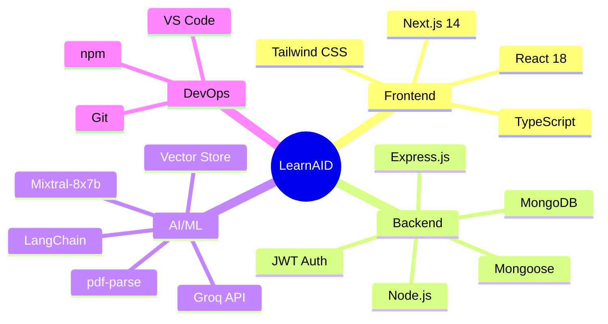

### Key Technologies

| Layer | Technology | Purpose |
|-------|-----------|---------|
| **Frontend** | Next.js 14 + React 18 | Server-side rendering, routing |
| **Styling** | Tailwind CSS | Utility-first CSS framework |
| **Backend** | Express.js + Node.js | REST API server |
| **Database** | MongoDB + Mongoose | Document database with ODM |
| **Authentication** | JWT + bcrypt | Secure token-based auth |
| **AI Service** | Groq API (Mixtral) | LLM for MCQ generation |
| **RAG** | LangChain + pdf-parse | Document processing & retrieval |
| **Vector Store** | In-Memory | Semantic search for context |

## 🔐 Security Architecture

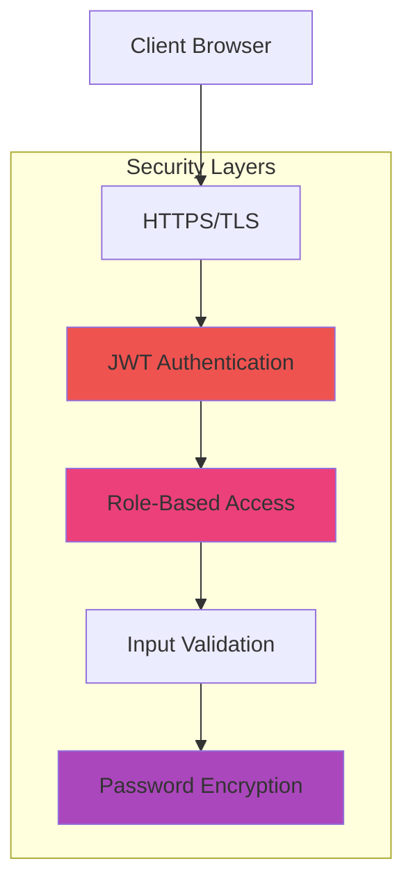

### Security Implementation

| Component | Implementation |
|-----------|----------------|
| **Transport** | HTTPS with TLS 1.3 |
| **Authentication** | JWT tokens with bcrypt hashing |
| **Authorization** | Role-based middleware (Admin/Faculty/Student) |
| **Validation** | express-validator for input sanitization |
| **File Security** | Multer with file type & size validation |
| **API Protection** | Rate limiting & CORS policies |

## 🚀 Deployment Architecture

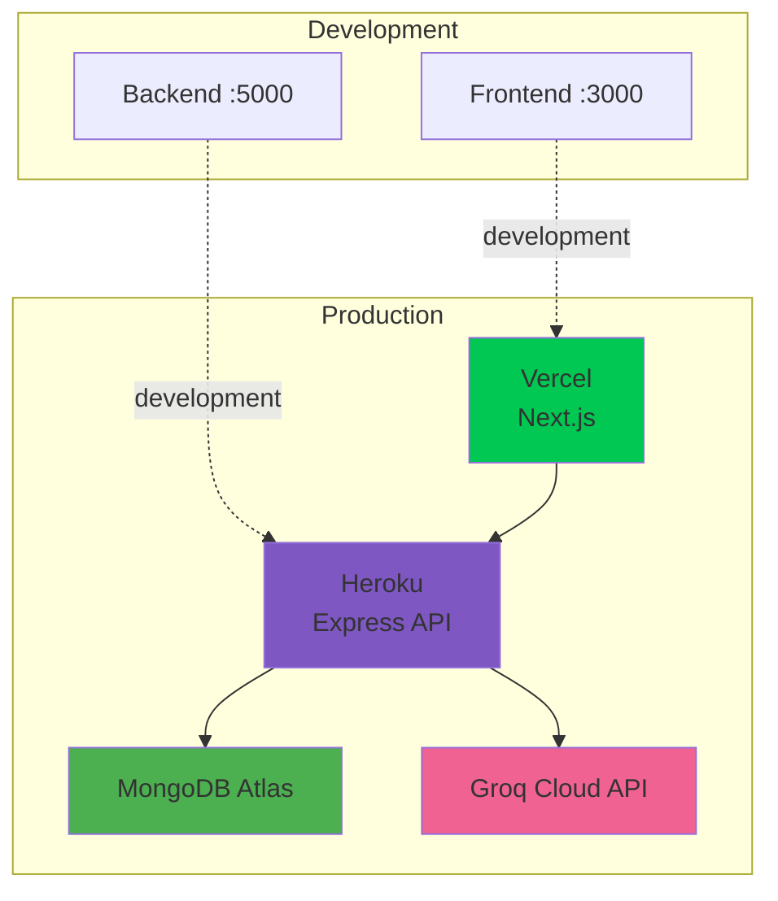

## 🌐 API Architecture

```mermaid
graph TB
    ROOT[API Gateway<br/>:5000/api]
    
    ROOT --> AUTH[/auth<br/>Login, Profile]
    ROOT --> USERS[/users<br/>CRUD]
    ROOT --> DEPTS[/departments<br/>Management]
    ROOT --> SUBJECTS[/subjects<br/>Courses]
    ROOT --> MATERIALS[/materials<br/>Upload/View]
    ROOT --> EXAMS[/exams<br/>CIA Exams]
    ROOT --> MCQ[/mcq<br/>AI Generation]
    ROOT --> ANALYTICS[/analytics<br/>Reports]

    style ROOT fill:#fff9c4
    style MCQ fill:#fce4ec
    style ANALYTICS fill:#e1f5fe
```

### Core API Endpoints

| Endpoint | Methods | Description |
|----------|---------|-------------|
| `/api/auth` | POST, GET | Login, authentication, profile |
| `/api/departments` | GET, POST, PUT, DELETE | Department management |
| `/api/subjects` | GET, POST, PUT, DELETE | Subject/course management |
| `/api/materials` | GET, POST, DELETE | Material upload & management |
| `/api/exams` | GET, POST, PUT | CIA exam configuration |
| `/api/questions` | GET, POST | Question-chapter mapping |
| `/api/marks` | GET, POST | Mark entry & calculation |
| `/api/performance` | GET | Chapter-wise analytics |
| `/api/mcq/generate` | POST | AI-powered MCQ generation |
| `/api/analytics` | GET | Dashboard statistics |

## 📦 System Components

### Application Layers

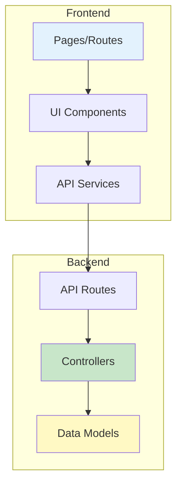

### Key Features

| Feature | Description |
|---------|-------------|
| **Department Management** | Hierarchical organization structure |
| **User Management** | Role-based access (Admin/Faculty/Student) |
| **Course Management** | Subjects, chapters, materials |
| **CIA Exam System** | Question-chapter mapping for analysis |
| **Chapter-wise Performance** | Automated calculation from marks |
| **AI MCQ Generation** | RAG-powered question generation |
| **Task Assignment** | Auto-assign tasks for weak students |
| **Analytics Dashboard** | System-wide insights and reports |

---

**Version**: 1.0.0  
**Last Updated**: November 13, 2025  
**Architecture**: Layered Architecture  
**Methodology**: Agile Development

---

## 🎯 Key Features

### Core Capabilities

| Feature | Description | Users |
|---------|-------------|-------|
| **Department Management** | Create, organize, and manage departments with hierarchical structure | Admin |
| **User Management** | CRUD operations for students, faculty, and staff with role-based access | Admin |
| **Subject Management** | Create subjects, assign faculty, enroll students | Admin, Faculty |
| **Material Management** | Upload, view, download, and organize learning materials | Faculty, Student |
| **AI MCQ Generation** | Generate contextually relevant questions from PDF materials using RAG | Faculty |
| **Assessment System** | Create and manage CIA exams with automated grading | Faculty |
| **Performance Analytics** | Track student performance with chapter-wise breakdown | Faculty, Student |
| **Dashboard Analytics** | System-wide insights and reporting | Admin |

### Advanced Features

- **RAG-Powered AI**: Retrieval-Augmented Generation ensures MCQs are contextually relevant to uploaded materials
- **Automated Performance Tracking**: Chapter-wise performance calculation based on question mapping
- **Role-Based Access Control**: Granular permissions for Admin, Faculty, and Student roles
- **File Management**: Secure upload, storage, and streaming of PDF materials
- **Interactive Quizzes**: Take MCQ quizzes with immediate feedback and explanations
- **Analytics Dashboard**: Real-time insights into user activity, enrollments, and system health

---

## � System Scalability

### Horizontal Scaling Strategy

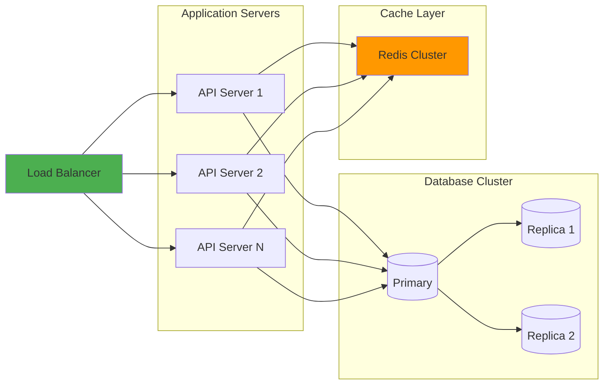

### Performance Optimization

- **Database Indexing**: Optimized queries with compound indexes on frequently accessed fields
- **Caching Strategy**: Redis for session management and frequently accessed data
- **CDN Integration**: Static assets and PDFs served via Content Delivery Network
- **Lazy Loading**: Code splitting and dynamic imports for faster initial load
- **API Rate Limiting**: Prevent abuse and ensure fair resource allocation
- **Connection Pooling**: Efficient database connection management

---

## 📝 Development Methodology

### Agile Sprint Framework

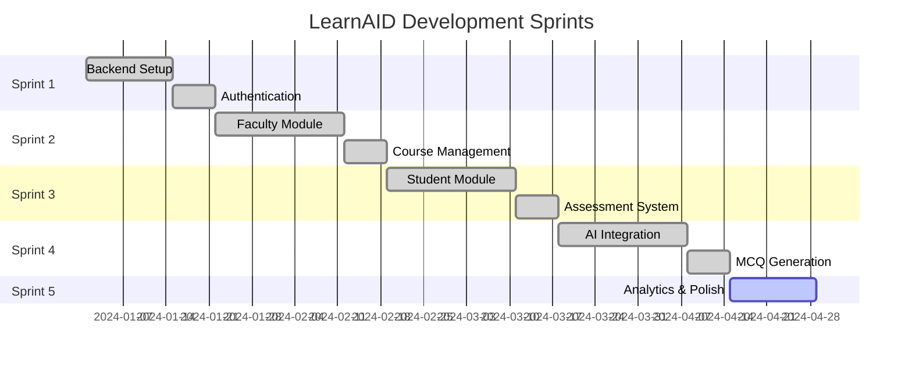

### Code Quality Standards

- **TypeScript**: Full type coverage for frontend code
- **ESLint**: Consistent code style and best practices
- **Documentation**: JSDoc comments for all functions
- **Error Handling**: Comprehensive try-catch blocks with logging
- **Testing**: Unit tests for critical business logic
- **Code Review**: Peer review before merging to main branch

---

## 🔄 Future Enhancements

### Planned Features

| Feature | Description | Priority |
|---------|-------------|----------|
| **Real-time Chat** | Student-faculty communication system | High |
| **Video Integration** | Embed lecture videos in chapters | High |
| **Mobile App** | React Native mobile application | Medium |
| **Offline Mode** | PWA with offline capabilities | Medium |
| **Advanced Analytics** | ML-powered insights and predictions | High |
| **Gamification** | Badges, leaderboards, achievements | Low |
| **Calendar Integration** | Exam schedules and reminders | Medium |
| **Notification System** | Email and push notifications | High |

### Technical Debt

- [ ] Migrate to MySQL for relational data integrity
- [ ] Implement comprehensive unit test coverage
- [ ] Add integration tests for critical workflows
- [ ] Set up proper logging infrastructure
- [ ] Implement API documentation with Swagger
- [ ] Add monitoring and alerting system
- [ ] Optimize PDF processing for large files
- [ ] Implement background job processing

---

## 📚 References

### Documentation Links

- **Next.js**: https://nextjs.org/docs
- **React**: https://react.dev
- **MongoDB**: https://docs.mongodb.com
- **Mongoose**: https://mongoosejs.com/docs
- **Express**: https://expressjs.com
- **Groq API**: https://console.groq.com/docs
- **LangChain**: https://js.langchain.com/docs

### Project Resources

- **GitHub Repository**: `github.com/Sardheesh-9230/LEARNAID-123`
- **API Documentation**: `/api-docs` (Swagger UI)
- **Development Guide**: `project-plans/DEVELOPMENT_INSTRUCTIONS.md`
- **Quick Start**: `project-plans/QUICK_START_GUIDE.md`

---

**Version**: 1.0.0  
**Last Updated**: November 13, 2025  
**Architecture**: Layered + Microservices-ready  
**Methodology**: Agile with Sprint Framework  
**License**: MIT
